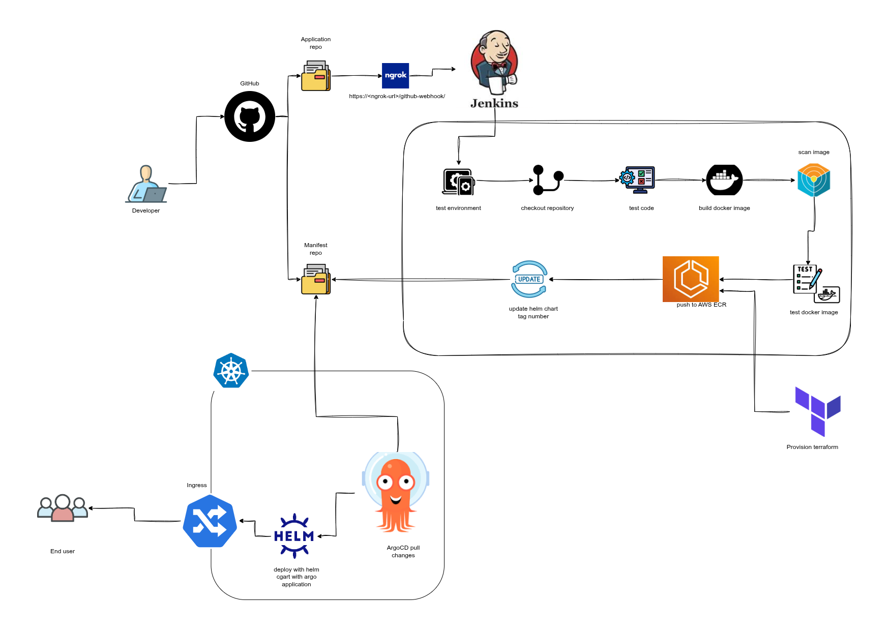

# CI/CD Pipeline with Jenkins, Docker, Helm, ArgoCD, and Kubernetes

This repository contains a full DevOps CI/CD pipeline architecture for automating application deployment to a Kubernetes cluster using Jenkins, Docker, AWS ECR, Helm, Terraform, and ArgoCD.

#### This project follows a GitOps workflow. 
The Kubernetes manifests and Helm charts are maintained in the [Infrastructure/Manifest Repository](https://github.com/KavishkaSasindu/fastapi-infra-manifest).

---

## Architecture

---

## Table of Contents
- [Overview](#overview)
- [Architecture](#architecture)
- [Workflow](#workflow)
- [Components](#components)
- [Setup Instructions](#setup-instructions)
- [Usage](#usage)
- [License](#license)

---

## Overview
This pipeline enables developers to push code to GitHub and automatically build, test, and deploy applications to Kubernetes clusters. The process ensures continuous integration, continuous delivery, and infrastructure-as-code provisioning.

Key features include:
- Automated Docker image building and scanning
- Helm-based deployment
- ArgoCD GitOps deployment strategy
- AWS ECR for container registry
- Terraform for provisioning infrastructure

---

## Workflow

1. **Developer Pushes Code**
   - Developers commit code to the application repository on GitHub.

2. **Webhook Trigger**
   - GitHub webhook triggers Jenkins using a public URL (e.g., via Ngrok).

3. **Jenkins CI Pipeline**
   - Jenkins checks out the repository.
   - Runs tests on the code in the test environment.
   - Builds a Docker image of the application.
   - Scans the Docker image for vulnerabilities.
   - Tests the Docker image.

4. **Docker Image Management**
   - Pushes the verified Docker image to AWS ECR.
   - Updates Helm chart tags with the new image version.

5. **Manifest Repository**
   - The updated Helm chart in the manifest repository is the source of truth for deployments.

6. **Infrastructure Provisioning**
   - Terraform provisions the required AWS infrastructure and Kubernetes resources.

7. **GitOps Deployment with ArgoCD**
   - ArgoCD pulls the changes from the manifest repository.
   - Deploys the application to the Kubernetes cluster using Helm charts.

8. **Ingress and End User Access**
   - Kubernetes Ingress exposes the application to end users via the cluster.
   - Users access the application through the configured domain.

---

## Components

- **GitHub**: Version control and code repository.
- **Jenkins**: CI/CD automation server.
- **Ngrok**: Exposes Jenkins to GitHub for webhook triggers.
- **Docker**: Containerizes applications for portability.
- **AWS ECR**: Stores Docker images.
- **Helm**: Manages Kubernetes deployment templates.
- **Terraform**: Infrastructure as code for provisioning cloud resources.
- **Kubernetes**: Container orchestration platform.
- **ArgoCD**: GitOps tool for continuous deployment.
- **Ingress Controller**: Manages external access to the Kubernetes services.

---

## Setup Instructions

1. **Jenkins**
   - Install Jenkins and required plugins (Git, Docker, Kubernetes, Pipeline).
   - Configure credentials for GitHub and AWS.

2. **AWS ECR**
   - Create an ECR repository.
   - Configure IAM permissions for Jenkins to push Docker images.

3. **Docker**
   - Install Docker on Jenkins nodes.
   - Configure image scanning tools (optional).

4. **Terraform**
   - Write infrastructure scripts for AWS resources and Kubernetes cluster.

5. **Helm & ArgoCD**
   - Create Helm charts for your application.
   - Install ArgoCD in Kubernetes and connect it to the manifest repository.

6. **Webhook Setup**
   - Use Ngrok to expose Jenkins to GitHub webhooks for CI triggers.

---

## Usage

- Push changes to the GitHub application repository.
- Jenkins automatically builds, tests, and pushes Docker images.
- ArgoCD detects the updated Helm chart and deploys changes to the cluster.
- End users access the application through the exposed Ingress URL.

---

## License

This project is licensed under the MIT License. See the [LICENSE](LICENSE) file for details.
